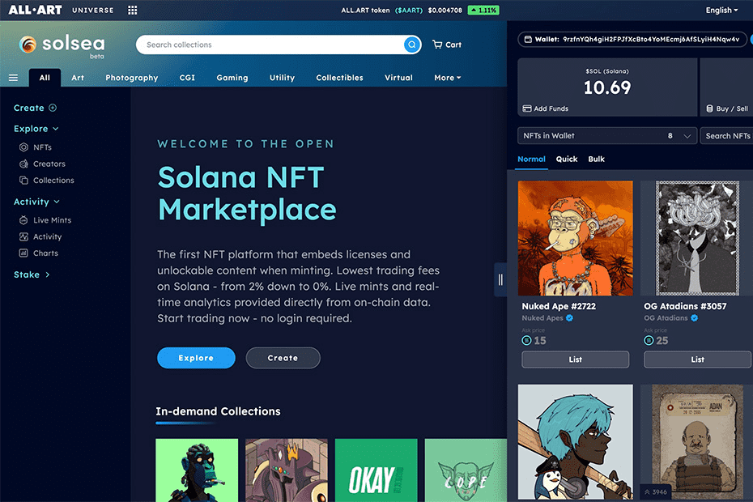

# SolSea

第一个在铸造时嵌入许可证和可解锁内容的 NFT 平台。 Solana 的最低交易费用 - 从 2% 降至 0%。直接从链上数据提供的实时铸币厂和实时分析。立即开始交易 - 无需登录。SolSea 重生 - 现场直播。 @SolSeaNFT。多合一的 Solana NFT 市场。我们围绕您的想法构建宇宙。你们更多。Solsea 因其廉价的体验而备受赞誉，但同样，这里唯一可用的 NFT 都是基于 SOL。除了在铸造过程中的费用，...Solsea 于 2021 年 8 月下旬推出，为其 NFT 市场的用户引入了许多开创性的功能。例如，它的...SolSea 是 Solana 上最大的 NFT 平台，引入了具有嵌入式许可证、最低交易费用和来自链上数据的实时分析的 NFT。

