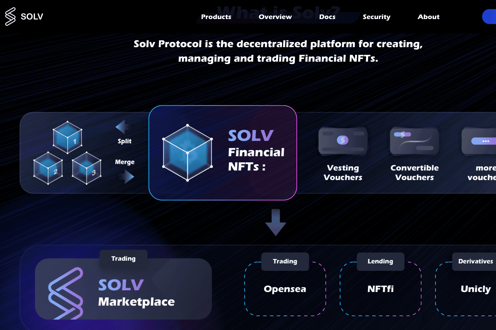

# Solv Protocol

Solv 协议是用于创建、管理和交易金融 NFT 的去中心化平台。 Vesting Vouchers 作为其首个金融 NFT 产品，是代表锁定归属代币的细分 NFT，从而释放其流动性并为加密项目的筹款、社区建设和代币流动性管理等金融场景提供支持。
Solv 的计划是双重的：首先，我们将推出不仅仅是一种，而是多种 FTV（金融交易凭证）来代表锁定分配、可转换债券、应收账款等资产。其次，我们计划成为所有金融 NFT 的第一个也是最大的链上市场。
网站：https://solv.finance/home
推特： https://twitter.com/SolvProtocol
电报：https://t.me/SolvProtocol

  不和谐： discord.gg/ewpb9jqzyD
  联系方式：contact@solv.finance

