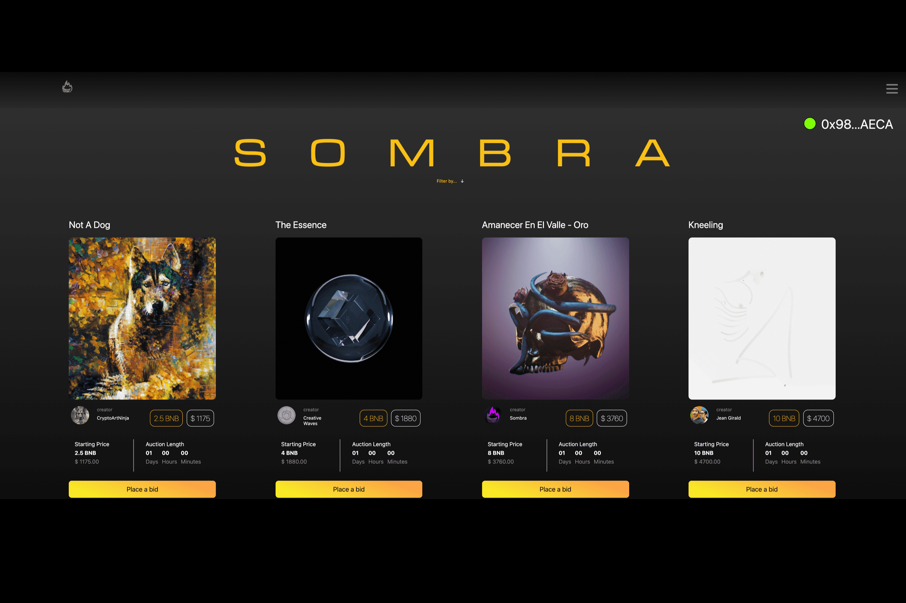

# Sombra

Sombra 是一个社交 NFT 市场和游戏生态系统，旨在将收藏家、艺术家和创新者聚集在一起，形成一个优雅的 dapp 解决方案。黑影让不可能成为可能。
Sombra 的合作伙伴在好莱坞视觉特效、数字艺术创作、经济和多层次公司管理方面有着深厚的根基，在最高级别拥有多年的经验。 Sombra = 社交网络遇到数字艺术画廊。 NFT 和游戏的 facebook。
通过 Sombra，用户可以联系他们最喜欢的艺术家，评论和喜欢他们的作品，并与他们的朋友分享不同的 NFT。黑影是未来。跟我们来。

