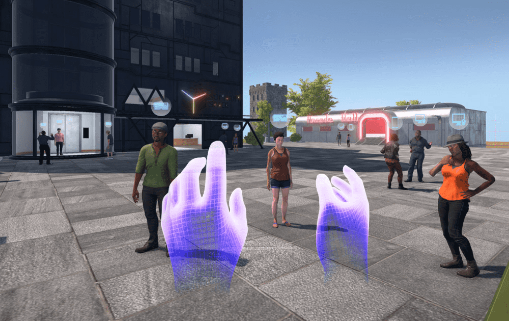

# Somnium Space

Somnium Space 是一个建立在区块链上的开放、社交和持久的 VR 世界，每个人都可以在其中购买土地、建造或进口物体和化身，轻松地将他们的体验货币化并沉浸在完全替代的现实中。我们最终的长期愿景是创建一个虚拟环境，为现实提供丰富的补充，充满新的和令人兴奋的可能性。作为一个跨平台的世界，Somnium Space 允许人们体验一个由玩家塑造的不断扩展、无缝的单一实例。与世界经济相结合，它为实现真正的元宇宙体验提供了下一步。Somnium Space邀请您进入一个不受现实限制的世界。一个充满可能性的世界，机会为那些...Somnium space 是一个开源平台和基于以太坊区块链的技术产品，可让您玩游戏、构建可编程环境、...

