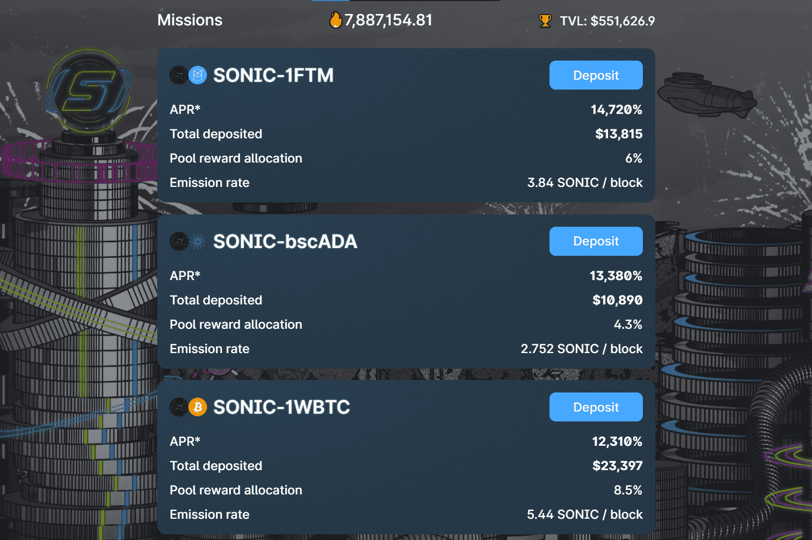

# SonicSwap

SonicSwap 是一个想法——一个简单地构建和支持 Harmony 网络和周围社区的想法。下一个优先事项是代币经济学，为流动性提供者和用户创造一个可持续的环境。
以代币经济学和社区参与为重点，我们希望构建所有人都可以参与和贡献的东西，同时满足用户的需求并为流动性提供者提供更稳定的投资组合增长。今天 SonicSwap 的实时价格为 0.0016714 美元/（SONIC / 美元），当前市值为 0 美元。 24 小时交易量为 5.3449755 美元。SonicSwap 是一个想法——一个简单地构建和支持 Harmony 网络和周围社区的想法。检查 CoinMarketCap 以查看您可以在哪里购买 SonicSwap 以及使用哪些货币。对于每种加密货币，CoinMarketCap 提供了一份购买清单......

