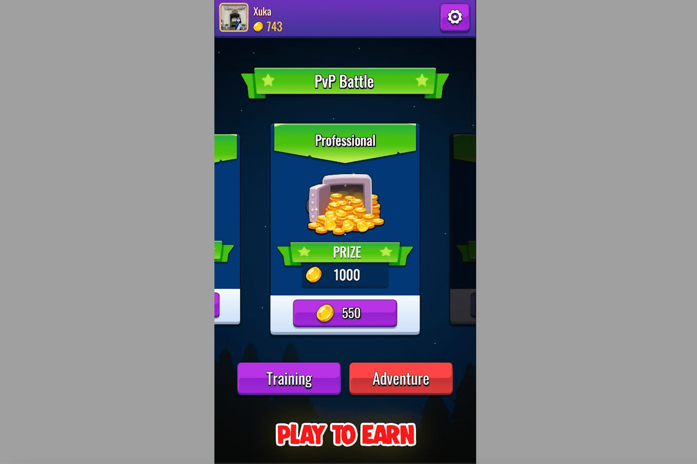

# Sort Master Battle

什么是排序大师之战？
排序大师之战是一个元界排序游戏，需要玩家的技巧和反应。
在第一场比赛中有3种主要模式：练习，冒险，战斗。玩冒险和战斗模式来赚钱。
未来会开发更多的游戏，形成排序游戏的世界（元界）。
Sort Master Battle 允许使用 SMB 代币在战斗模式下投注或在所有游戏中购买 NFT 物品。将它们全部排序以赢得战斗。更新于。 2021 年 12 月 22 日。行动。数据安全。箭头前进。安全始于了解开发人员如何收集和...排序大师对战游戏，排序大师对战百科介绍，592btc在全球Dapp上探索NFT、NFT市场、区块链游戏、De-Fi、区块链上的Dapp。

