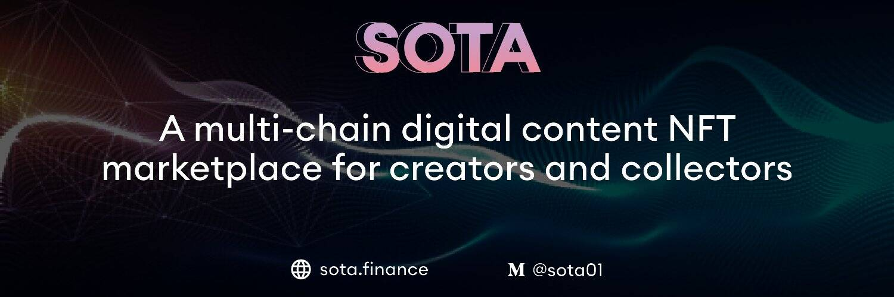

# SOTA

不可替代的代币或“NFT”已经席卷全球——从 2017 年的 CryptoKitties 开始，已经发展成为一个价值数十亿美元的行业，吸引了主流和加密世界。从数字艺术到收藏品，从游戏到赚取资产，从梦幻体育到知识产权，NFT 正在为创作者、品牌和艺术家等创造直接与全球用户互动的新方式。 IoTeX 通过首个原生 NFT 市场 SOTA Finance 向不可替代领域迈出了重要一步！从全球领先的加密货币获取 SOTA ... 加密货币。赞助... 热门货币和代币。此外，用户在参与平台活动时获得平台的治理代币 SOTA，登录时空投、买卖以及 FT 币贡献。Sun Of The Ages ( *SOTA* ) 加密货币，以美元和卢布表示的硬币（*代币*）的市值和价格预测，推出01 Jan, 1970，地址0xb43bEcE904DB03caFA1A86a1c651db0b97D81DdF， ...

