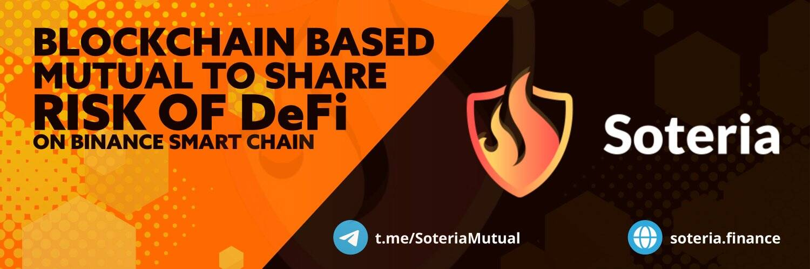

# Soteria

Soteria 允许用户购买保险，以大大减少或降低黑客的财务风险。它取代了传统保险公司的想法，因为它由成员全资拥有。该模型鼓励参与，因为成员因参与风险评估、索赔评估和治理而获得经济激励。Soteria 与企业合作设计和增强安全计划，以抵御网络威胁，同时保持业务连续性。Soteria 是一项社区服务，为遭受精神困扰或危机的人们提供空间。 ... Soterias 是开放的，没有约束设施。洛伦...Soteria是一个基础区块链的互助平台，以分担DeFi的风险。WSOTE以1：1的代币通过SOTE生成。WSOTE可用于外部交易的，但无法在Soteria平台内使用。
