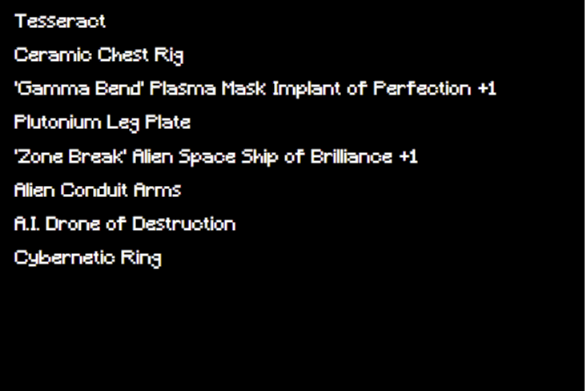

# Space Capsules

很长一段时间以来，我们一直在尝试联系火星人。现在，我们有技术可以做到这一点。链上转发器使我们能够向火星人写信息并接收从太空发射的太空舱。铸造一个转发器并获得一个“太空舱”作为火星人的礼物。它包含您的太空装备，对于您进入太空探索和殖民的冒险至关重要。您可以随时使用您的转发器在给火星人的信息中写一个字。 ‍ 消息作者还将获得其书面文字的 NFT 作为感谢。 ‍ 为了让火星人的信息长度可控，我们将信息限制在 8,888 个转发器和太空舱内。所有的转发器、太空舱、文字和广播消息都是完全在链上生成的。太空探索和建造将在所有转发器被铸造后立即开始。

