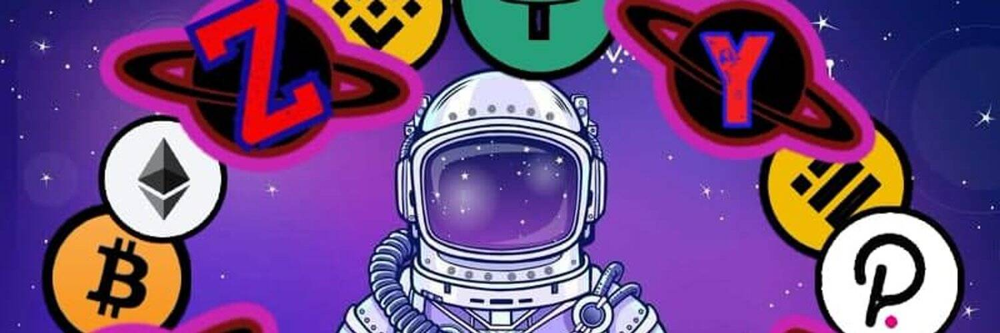

# Space Defi Saturn Polygon

Space Defi 生态系统：
*多边形网络上的新产量农业，土星$ STRSuperNova Token $SPN 为您带来更多优势Space Defi土星多边形统计；用户。 -。 — ;交易。 -。 — ;体积。 0 美元。 — ;平衡。 0.34 美元。 -2.86%。Saturn Polygon (poly-saturn.space-defi.com) ... 在过去三个月一直是单产农业生态系统的细心旁观者并分析...Papercraft 3D ASTRONAUT COSMONAUT 太空服艺术低聚纸雕塑 DiY 礼物...多边形太空人 T 恤 | MATIC T 恤 | Defi 衬衫 |宇航员 T 恤...我的月球模型的当前版本有 4600 万个多边形，陨石坑和山脉是……环绕土星，超高清。
尼克·史蒂文斯图形 · 尼克·史蒂文斯 · 2016 年 2 月 9 日

