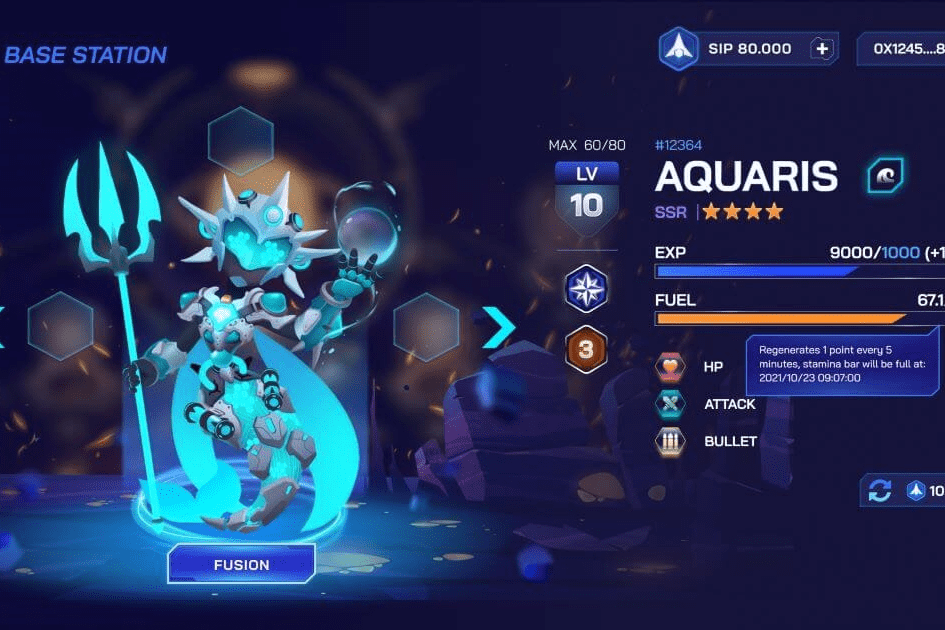

# Space Sip

介绍
Space SIP (SIP) 是一款在币安智能链平台上开发的 Play to Earn NFT RPG。游戏围绕着获得一艘传奇的宇宙飞船和一个可以使用的强大武器展开。玩家可以发送宇宙飞船来挖掘 $SIP 代币。玩家可以使用他们的资产参与战斗以获得 $SIP 代币。资产是按照 BEP-721 标准铸造的玩家拥有的 NFT，可以在专有市场上交易。 NFT 在 Chainlink VRF 中得到了稀有性证明。
愿景和使命宣言
Space SIP 团队的愿景是让任何年龄的每个人都能享受他们玩游戏的时间，并让他们的时间得到充分利用。他们甚至可以从中获得可观的收入！ Space SIP 团队的使命是创造“玩得开心”和“玩得开心”的游戏，为玩家的生活带来欢乐和繁荣。 Space SIP 的开发者希望玩家能够享受他们在游戏中和现实生活中的活动，这就是为什么 Space SIP 区块链游戏生态系统能够提供他们所需的一切。

