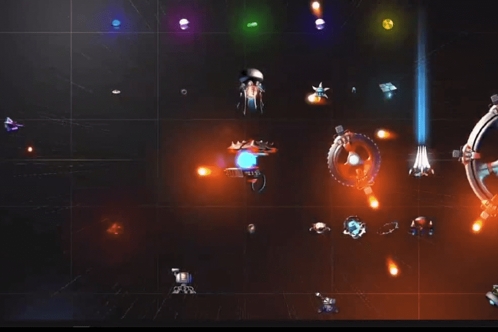

# Space War Zone

Space War Zone 是一款基于玩赚 NFT 的动作游戏。这些是处于战区的太空飞机，在那里它们将遇到障碍物，例如小行星和必须消灭才能生存的敌人。
该视频游戏采用 2d 设计，具有简单的可玩性。您将不得不使用 ASDW 键来移动您的 NFT 飞船并用空格键射击敌人的飞船和小行星。
游戏将有3种战斗模式
训练模式
测试你的飞船统计数据的理想场所，你将面对你必须摧毁的恼人的小行星。您将在飞船的操控和战斗中积累经验。
PVC 模式
你的宇宙飞船将遇到它的第一个敌人，邪恶的克隆人的中间模式。您应该清理该区域并消灭所有人。
PvP模式
电子游戏爱好者最喜欢的区域，您的宇宙飞船必须做好准备并处于最佳状态，以面对其他玩家的宇宙飞船。
宇宙飞船将成为电子游戏中的可玩对象。你可以用它射击、移动和执行你的战斗策略。你可以在神秘盒子或市场上买到它们。
宇宙飞船的类型
Rookie是主力飞船。
竞争的是先进的宇宙飞船。
致命是最后一代宇宙飞船。
战略是最敏捷和智能的宇宙飞船。
英雄是破坏性的宇宙飞船。

