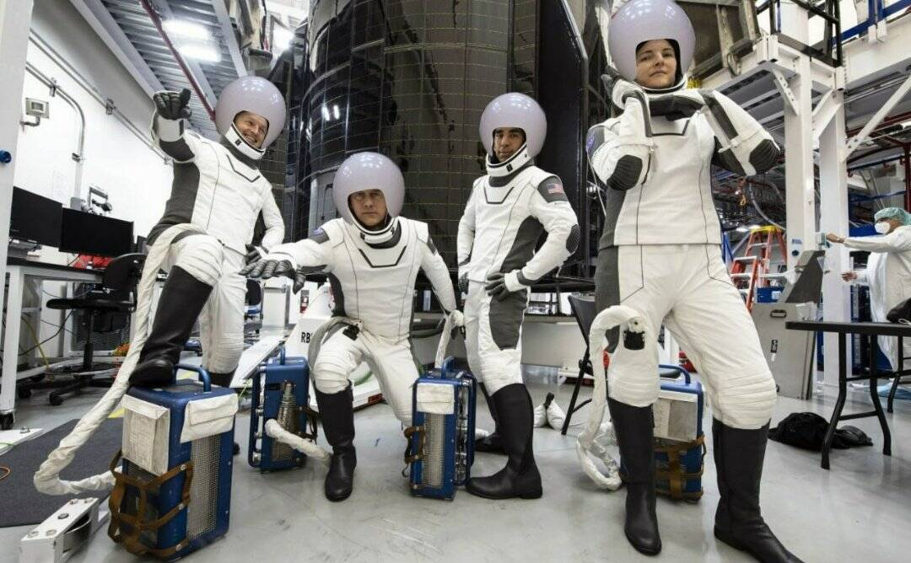

# Spaceballs

SpaceBalls 是币安智能链上的一种新的加密模因硬币。它起源于埃隆马斯克关于美国太空歌剧模仿电影“太空球”的推文。这位亿万富翁技术企业家最近发布的这条病毒式推文激发了我们的社区接受 80 年代科幻喜剧与加密货币中出现的现代去中心化金融行业之间的独特关联。>Github从文件夹中下载所有文件·Github加密头应用程序在java文件下载·Gitlab 88下载·Git从文件夹中下载所有文件·Git加密头应用程序...Sm 580驱动下载打印·m64每个对象都是一个加密模块下载·Smadav 2020完整版免费下载... 下载usb加密狗程序· 下载usb支持epson lq 1170驱动程序windows 7 ...

