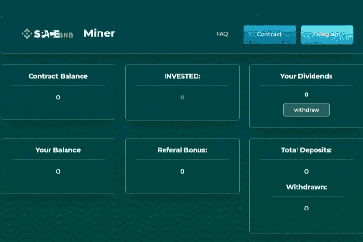

# SpaceBnb Miner

每项投资都会为您带来相当于池代币的每日应计收益。余额补充使用代币（BEP-20）进行。提款完全独立于开发人员并随时即时进行。完成代币确认程序并将其发送到长期投注，随时再投资和提取资金 简单的优势 为什么现在开始： 被动收入容易从少量开始 全天候取款 接收来自您的合作伙伴的每日付款 这pool 旨在运行一个长期账户，成员可以加入和离开，长期持有者将因他人的行为而获得奖励。什么是 SpaceBnb 矿工？每项投资都会为您带来相当于池代币的每日应计收益。余额补充是用代币（BEP-20）进行的......检查来自客户的 spacebnb.finance 评论是否是骗局、付费或合法的。 ... xooop.com 6,145.38 美元；挖矿-tron.com $5,000.00 ...

