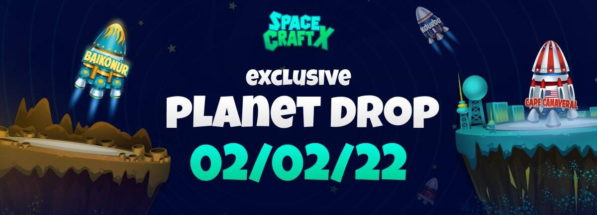

# SpaceCraftX

什么是 Space CraftX
漫不经心的十年挥霍……我们到了。
资源严重匮乏！现在，人类的生存和地球文明的发展取决于替代能源和地球以外的资源。只有最勇敢的地球人才敢选择太空工匠的道路。
太空工匠们在远离家乡的星球度过他们的日子，参加长期危险的旅程——寻找新的强大储备和能源。这项工作既困难又危险。因此，只有潇洒和富有创造力的球员才能在历史上留下他们的名字，获得他们的名声和认可。其他人将有机会充实自己。这对很多人来说都很好。
在他们旅程的第一阶段，太空工匠有机会提取三个被地球人高度重视的太空元素。这些是🔹波——合成能量的空间波； 🔹宇宙尘埃和🔹暗物质，用于生产和修理工具。
Space CraftX 是一款空间 NFT 游戏，具有完美的经济模型、有趣的情节以及将游戏代币兑换成加密货币的可能性。在 Space CraftX 游戏中提取各种空间资源，建立自己的采矿厂，感觉自己是真正的空间创造者。

