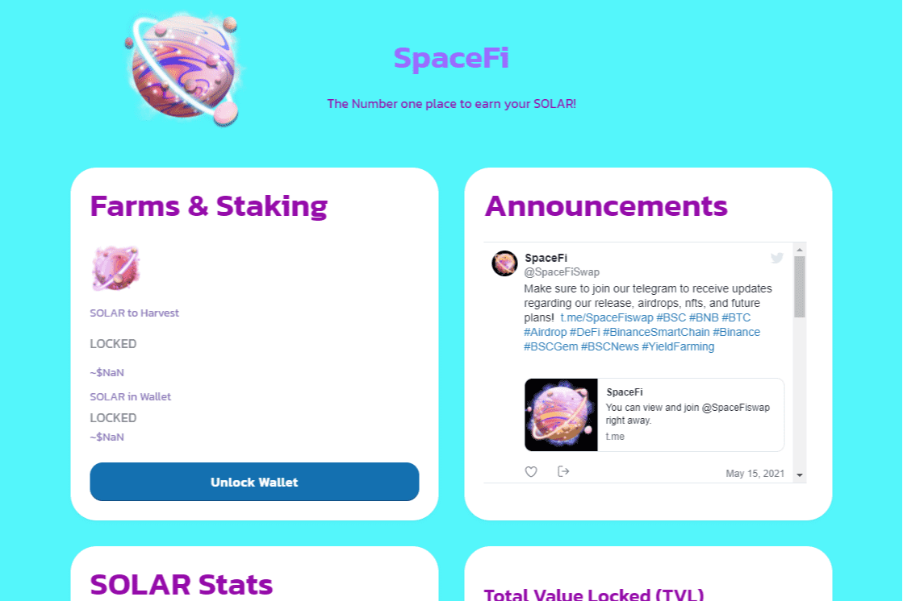

# SpaceFi

SpaceFi 的使命是为收集被认为是 NFC 的收藏品带来全新的体验，直至收获农业和彩票！SpaceFi 是 Evmos 和 zkSync 上的跨链 web3 平台，初始产品为 DEX+NFT+Starter+Spacebase。第一个连接 Cosmos 和 Layer2。SpaceFi 是一种革命性的代币，为下一代 Web 3 高科技实用程序提供动力，建立在以太坊之上，拥有无与伦比的产品组合； SpaceFi 应用程序...SpaceFi 是一个跨链的 web3 平台，在 Evmos 上有 DEX+Farm+NFT+Starter+Spacebase，将部署在 layer2 zkSync 和 Celo 等其他 EVM 链上...在 Medium 上阅读 SpaceFi 的文章。 SpaceFi 是 Evmos 和 zkSync 上的跨链 web3 平台，初始产品为 DEX+NFT+Starter+Spacebase。

