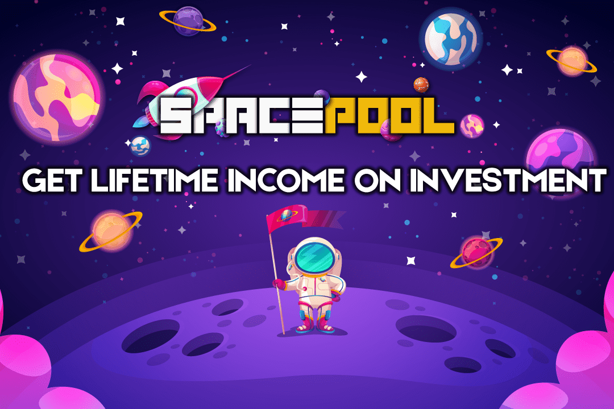

# SpacePool

这个怎么运作：
每项投资都会为您带来相当于池代币的每日应计收益。余额补充使用代币（BEP-20）进行。提款完全独立于开发人员并随时即时进行。通过代币确认程序，将其发送到长期投注，随时再投资和提取资金。
计划的：
计划 17% / 9 天
计划 15% / 12 天
计划 12% / 24 天
计划 8% / 40 天
最低：10 美元
很棒的营销计划。
我们有一个完美、可靠、经过审计的合同，超过 4 个稳定和活跃的项目。
您可以通过参与每个池获得超额利润，现在就利用这一点。
该矿池旨在运行一个长期账户，其成员可以加入和离开，长期矿池持有者将因他人的行为而获得奖励。
推荐计划： 1 级：7% 2 级：5% 3 级：3% 4 级：2% 5 级：1%
（收到推荐计划的最后一个lvl，您将获得每个投资者的18％）

