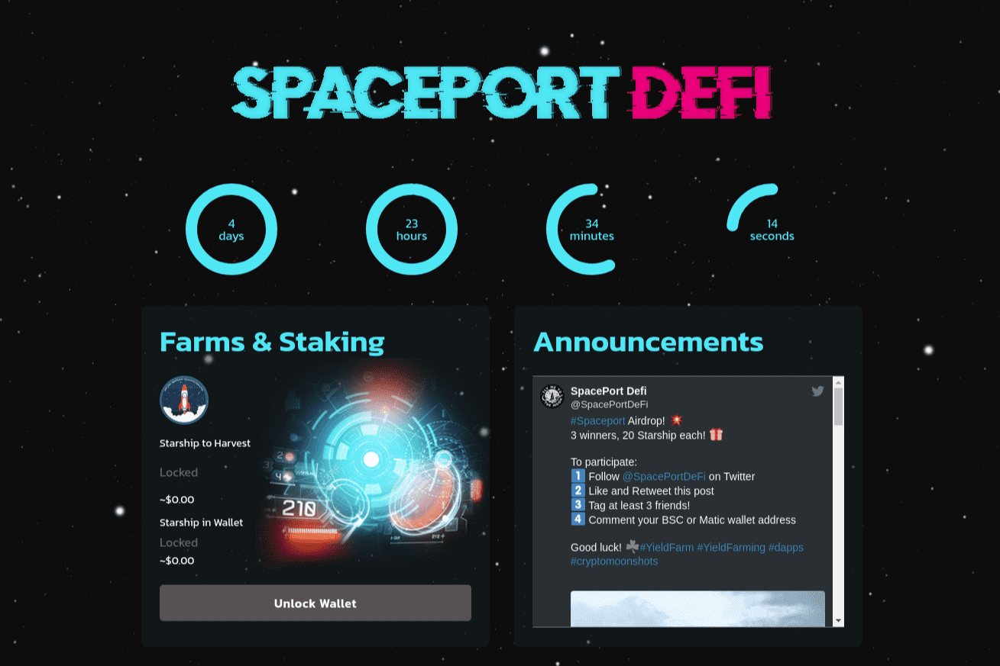

# SpacePortDeFi - BSC

SpacePortDeFi，您在 Polygon 和 BSC 上的跨链 DeFi 启动板。我们可持续发展的农场和游泳池一定会让您大开眼界！SpacePortDeFi，您在 Polygon 和 BSC 上的跨链 DeFi 启动板。我们可持续发展的农场和游泳池一定会让您大开眼界！查看更多。SpacePortDeFi - BSC 是一个跨链启动板。它位于多边形和 BSC 上。但是，它也为用户提供了一个收益农场。平台的原生代币...SpacePortDefi 第四次探索。平衡计分卡。多边形。 RugDoc 评论。一些风险。 SpacePortDefi 3rd Exploration 的分支。在 BSC 注册并获得 125% 的首存红利！去中心化成为所有人的现实。
Dapp.com 是一个让每个人都可以轻松发现、使用和享受 dapp 的跨链平台。探索基于 Ethereum、EOS、Tron、Klaytn、NEO、Steem、IOST、TomoChain 等构建的 3,000 多个 dapp。

