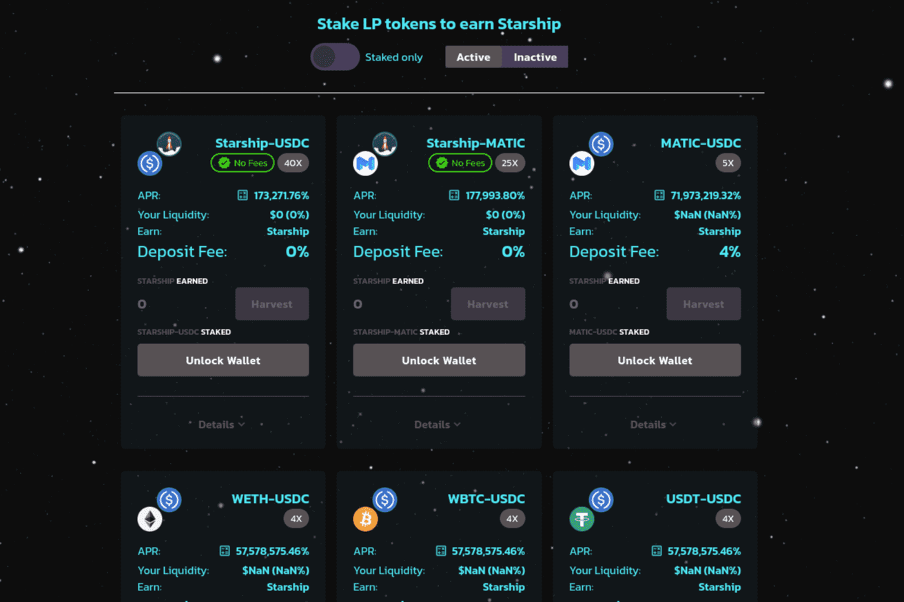

# SpacePortDeFi - Polygon

SpacePortDeFi，您在 Polygon 和 BSC 上的跨链 DeFi 启动板。我们可持续发展的农场和游泳池一定会让您大开眼界！SpacePortDeFi Polygon 用户、交易、交易量、排名和最新用户评论的完整分析。阅读相关新闻、更新、活动和讨论...SpacePortDeFi。 ·。 2021 年 8 月 12 日。BSC 和 POLYGON 农场在 3 小时 30 分钟内启动！确保在四月开始减少之前进入。PolygonScan 上的 SpaceportDeFi 代币 (UFO) 代币跟踪器显示代币的价格为 0.00 美元，总供应量...... Polygon 赞助的插槽可用。paceportdefi.com - SpacePortDeFi - Polygon · Alexa 排名历史 · 流量估计 · 域信息 · 错别字 · 评级 · 受众地理 · Whois。

