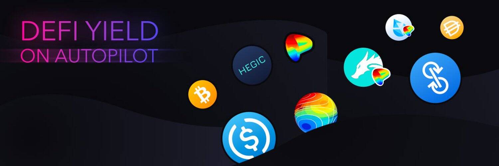

# Sparta

Sparta 是一家程序化的“社区拥有的银行/基金”，通过向其成员提供无担保贷款，通过 DeFi 收益优化和利率共享相结合，帮助其成员赚取高利率。Sparta 建立在 AkropolisOS 之上，这是一个用于创建营利性 DAO 的可升级框架。初始版本支持以下功能：(a) 使用联合曲线的流动性和激励管理，(b) 抵押不足信贷的资本协调机制，(c) 收益率再平衡器。因此，它旨在将新的 DeFi 发展转化为可证明有偿付能力的储蓄/养老基金的最初愿景，独立于银行系统，并能抵御通货膨胀和广泛的攻击媒介。抵押不足的贷款和收益池该数据代表被跟踪智能合约的原始链上活动

