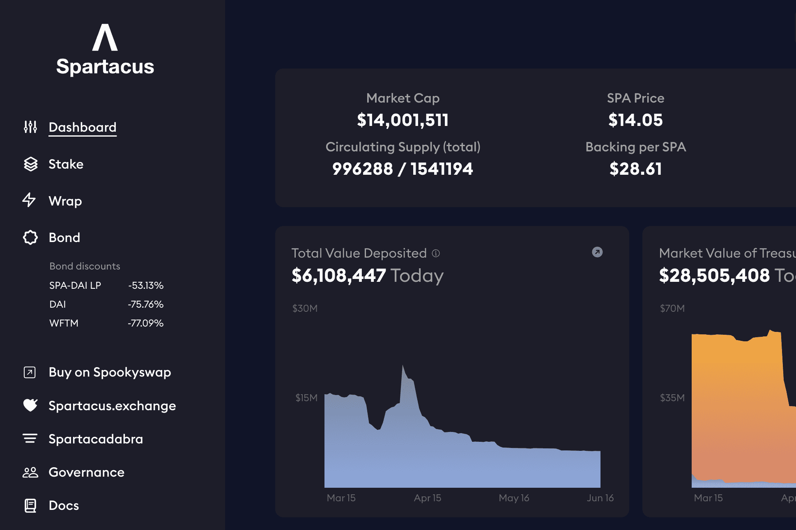

# Spartacus

我们的目标是将 SPEX 打造成 Fantom 上领先的 DEX 之一。但是，我们不会止步于此。我们相信 ve(3, 3) 的资本效率将在以太坊主网上找到最佳应用，在那里 SPEX 将向更广泛的加密社区开放Fantom 网络上最大的国库储备协议鑫达比特币资讯网·斯巴达克斯·鑫达区块链环球货币开发（从沃斯世界经济论坛，看区块链和数字货币的三大发展趋势）·熊猫区块链（1V1电）竞战队熊猫推出全新LOGO）。Spartacus 加密货币如何调整？ Spartacus 是一种代币，这意味着它是一种代加密货币，它的活动基于其他加密货币的区块链，例如以太坊区块链或 EOS 区块链。 ...

