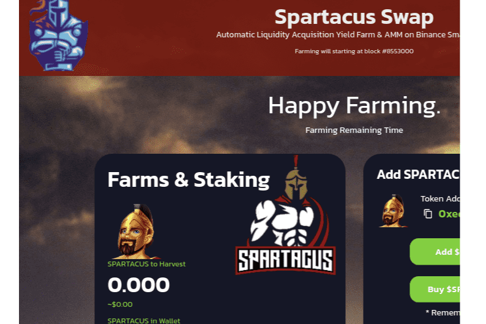

# SpartacusSwap

SpartacusSwap 是 Binance 智能链上全新的去中心化交易所，被称为第二代收益耕作机制，可通过 TIMELOCK 合约在发布时以可持续且可盈利的耕作收益实现永久价格上涨！
主要特点 ：
自动销毁机制 每次转让都会产生 8% 的转让税费。每次转账都会自动烧掉 8%。
自动流动性机制 每次转账都会产生 8% 的转账税费。
收获时间锁定 收获时间锁定是一种独特的奖励查找机制，用于限制收获的频率。它旨在防止农业套利机器人不断收获和倾销。
超过总供应量 0.5% 的转让将被拒绝。随着总供应量的增加，这个比例会降低。
推荐计划 已实施链上推荐计划，以激励用户邀请朋友加入农场。邀请者可以永久赚取他/她朋友收入的 3%。

