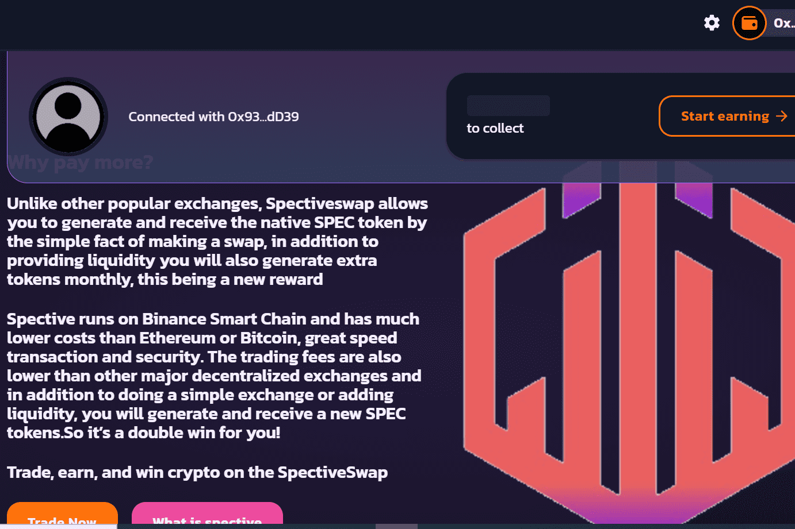

# Spectiveswap

与其他交易所不同，带有收益农场的去中心化交易所，在 spectiveswap 中，您生成和接收代币只是为了执行交换。
流动性提供者每月获得额外奖励，除了交易对增加流动性的佣金外，您还可以投注 LP 代币以生成和接收更多 SPEC 代币，很快我们将添加贷款、彩票、NFT 市场和投票平台中央 。具有收益农场和额外奖励的自动做市商Spectiveswap dApp：Spectiveswap 是一个 DeFi 平台。这是一个基于 AMM 的 DEX，集成了单产农业。查看完整分析！SpectiveswapDefi,Spectiveswap百科介绍,592btc在全球Dapp上探索NFT、NFT市场、区块链游戏、De-Fi、区块链上的Dapp。

