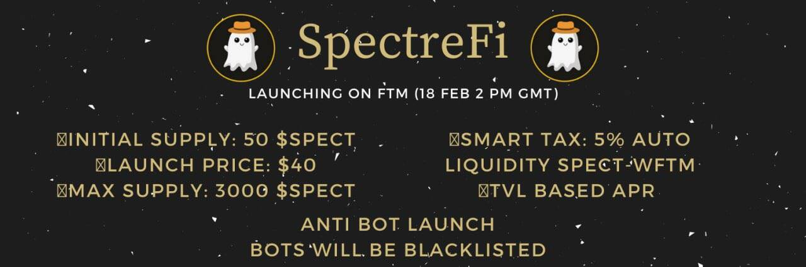

# SpectreFi

SpectreFi 提供了一个全新的基于 TVL 的 APR 功能，鼓励用户质押他们的代币。 TVL 越高，APR% 就会越高
来自 Assuredefi 的 KYC
反机器人功能（机器人将被列入交易黑名单）
细节：
🕐上市发布日期：格林威治标准时间 2 月 18 日下午 2 点
⏱Farming Launch（48 小时后）：格林威治标准时间 2 月 20 日下午 2 点
💎初始供应：50 $SPECT
💵发布价格：$40
💰最大供应量：3000 $SPECT
👻Dex：SpookySwap
💦智能税：5% 汽车流动性 SPECT-WFTM

