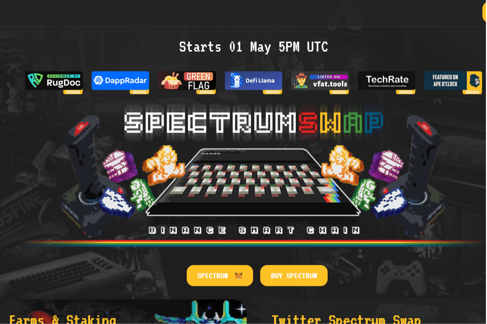

# Spectrumswap

Spectrumswap DEFI - 收益农场 | Binance Smart Chain Yield Farming 是通过作为 Spectrumswap 的去中心化应用程序 (DApps) 投资加密货币或代币，收益农场平台以最大化利润。熟练的单产农民不仅可以从其持有的价格升值中获得利润，还可以从这些持有的产量中获得利润。 Spectrum 代币初始流动性：500 Spectrum 发行价格：1 美元 最大供应量：850,000 Spectrum 总转让税率：每次 Spectrum 转让的 2% 对农业不征税！发射率 0.06 Spectrum/Sec NO Harvest LockupDEFI - 产量农场 |币安智能链订阅我们的新闻
订阅每周回顾时事通讯，将最新趋势直接发送到您的收件箱

