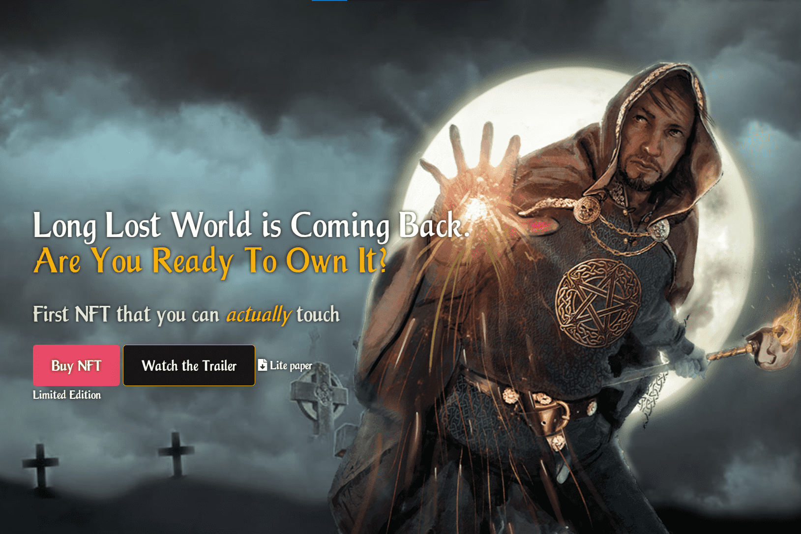

# SPELLFIRE

Spellfire - 一款纸牌游戏，让玩家潜入幻想世界，掌握魔法和蛊惑的艺术，与最强大的怪物战斗，并成为从湿沙漠到神圣死地的最伟大领域的统治者。现实与幻想之间的粗线：英雄成为恶棍，最亲密的盟友犯下最令人惊讶的叛国罪。
新版本 Re-Master the Magic 带来了魔法创意世界和未来创新的二重奏。作为革命性的可触摸 NFT 制成的收藏卡可以在现实生活中购买或以数字格式存储。交易、投资和终生收入来自游戏。
什么是法术之火？
30 年以上的神奇纸牌游戏使用独特的 QR 编码加密资产进行数字化。
市场上第一个 - 可触摸、可收藏和可升级的 NFT 可用@DeFi。
革命性提供了个性化的 NFT 卡——现实生活中的人、地方或城镇可以成为数字 Spellfire NFT 并加入游戏赚钱游戏。
安全增长的投资——90% 的 NFT 为持卡人创造了利润。

