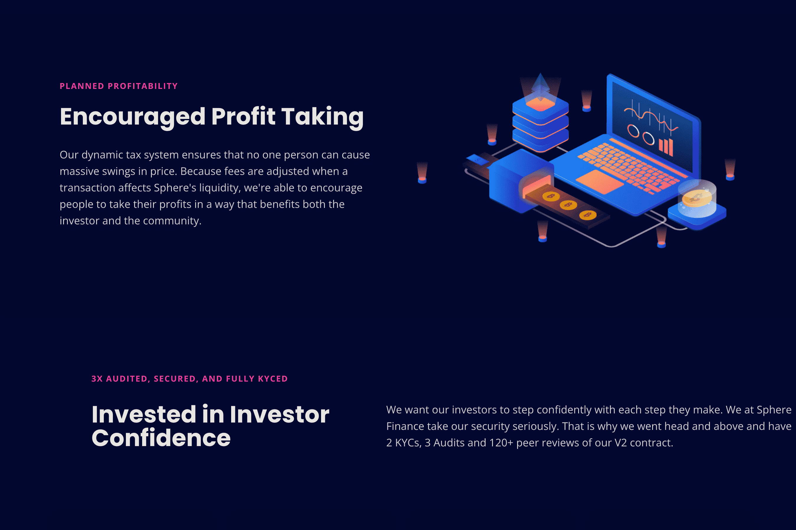

# Sphere Finance

简单
当您购买 $SPHERE 时，您的钱包中已经发生了自动质押。您不必处理我们的网站！从您购买 $SPHERE 的那一刻起，您就自动有资格获得 Rebase 福利。 DeFi 中最人性化的自动质押系统。
力量
由于 APY 在不同的协议中波动，因此无法预测在给定时间范围内您将收到多少代币。 SAP 向 $SPHERE 持有者支付 1.910% 的每日固定利率，或 99,900% 的年利率。
和谐
其他流行的质押协议每 8 小时发放一次付款。 Sphere 的自动质押系统每 30 分钟或每天 48 次付款。
努力
团队有很大的野心。我们的团队由以前使用过大型协议并了解如何赚取流动性以获取更多流动性的人员组成。基本上，您的流动性用于为协议赚取更多流动性，最终为您作为投资者。产量上产量上产量。
鲁棒性
与其他协议不同，我们优先考虑安全性。这意味着第一份销售合同（更多细节即将推出！）应该为投资者提供最小的风险。您是否曾目睹过有问题的协议吸走了投资者来之不易的流动性？我们也鄙视这些。这就是我们坚持最高安全标准的原因。
排放
我们如何尝试发行这么多代币，而不会使它们的价格跌入 0 的无尽深渊？简单的。我们引入了税收原则。这些变量不得超过 20% 的阈值。税费被拆分并用于协议中的不同操作（更多内容在即将发布的 Tokenomics 文章中）。

