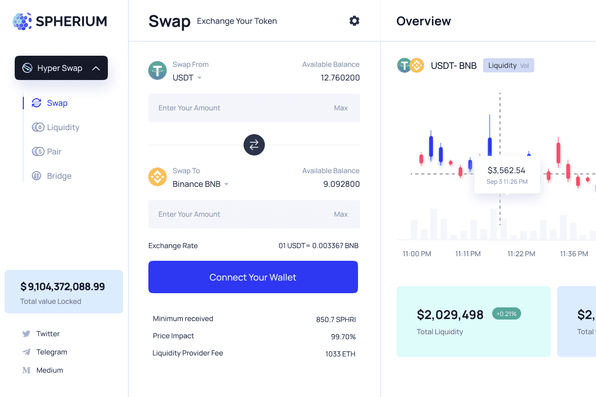

# Spherium Finance

Spherium Finance All-in-One 跨链 DeFi 协议提供一整套金融服务，包括通用钱包、代币交换平台、货币市场和跨链流动性转移。 Spherium 将作为全球金融服务提供商，将基础金融服务扩展到没有银行账户的人群。
Spherium Finance 提供以下解决方案：
HyperSwap：基于自动化做市机制的去中心化资产互换交易所，轻松连接跨链ETH-BSC桥。
HyperLend：去中心化货币市场，投资者可以在其中以供求规律确定的利率借出或借入数字资产。
Spherium 钱包：用于 Spherium 产品和服务的去中心化和安全钱包。
Spherium 通过提供具有多资产、跨链互换、加密融资解决方案和跨链可操作性的单一平台和移动应用程序来解决当前 DeFi 行业的碎片化问题。 Spherium 还引入了用户友好的界面。

