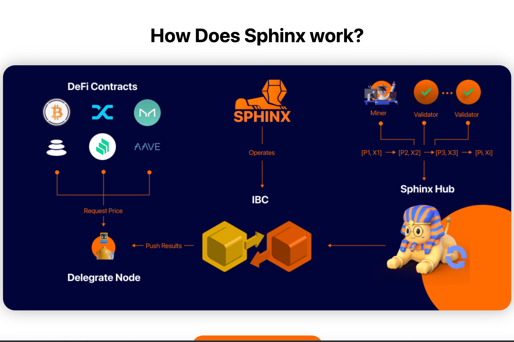

# Sphinx Finance

Sphinx 旨在设计一款能够应对当前 Defi 资产规模并随着其增长而适应未来 Defi 运行环境的预言机。
预言机应该具有与使用预言机协议的资产大小相同数量级的抗攻击性。
预言机的速度和可扩展性应该与智能合约的应用场景相匹配。
高吞吐量、跨链兼容性一致性为 Defi 提供了更高的可组合性。SPHINX 是一个跨链预言机，为智能合约提供多样化和可靠的数据该数据代表被跟踪智能合约的原始链上活动

