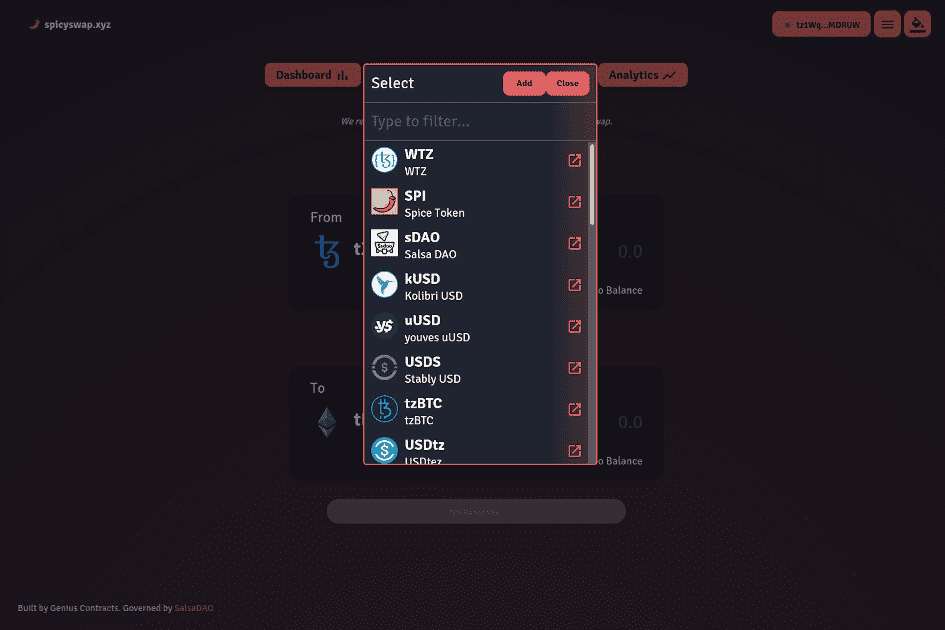

# SpicySwap

SpicySwap 是 Genius Contracts 专门为 Tezos 上的代币交换构建的下一代 DEX。 SpicySwap 由 SalsaDAO ($sDAO) 管理，它是更广泛的 Genius Contracts 平台和产品套件的管理实体。 SpicySwap 协议受到 Uniswap V2 通用框架的启发，但合约已从头开始重写以与 Tezos 兼容。合约代码审查由专注于 Tezos 的开发公司 Functori 完成。
SpicySwap 的核心功能是交换、提供流动性和 Spice Farming。 Spice Farming 是一项协议级功能，允许用户从他们选择的池中的每次交换中收取 0.1% 的费用。流动性提供者从每次掉期中收取 0.2% 的费用，相当于掉期总费用的 0.3%。
SpicySwap 协议还包含面向开发人员的高级功能。 SpicySwap 允许通过乐观交易启用闪贷和闪兑。此外，每一对都可以用作低级合约集成的去中心化价格预言机。这种时间加权价格具有抗操纵性，将开启基于 SpicySwap 的复杂 DeFi 交互。

