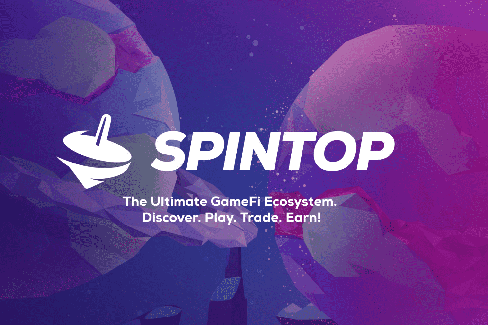

# Spintop

什么是 Spintop？
Spintop 是下一代区块链游戏中心，旨在利用 web3 的新工具为玩家、交易者和投资者提供全面的体验。在 Spintop，我们渴望通过区块链游戏来引导、讨论和供应。该生态系统被设计为一个游戏中心，允许玩家交换他们的代币、NFT 和评论。
Spintop 由五种主要产品组成，这些产品以社交方式共同作用，并围绕用户资料构建：

  Gamepedia：一个社区驱动的游戏指南，在其中访问、列出和过滤游戏的代币经济学、评级、智能链和开发状态。游戏也受到评论家和用户的评论。
  Spindex：一个去中心化交易所（Dex），游戏代币汇集在一起以创造流动性，激励收益农业。
  Guild Maker: 游戏赚钱赞助商和学者的聚会场所。赞助商可以销毁 SPIN 并创建自己的收益行会，招募学者并相互竞争。
  NFT 市场：NFT 市场将成为公会、用户和游戏的供应区，他们将在其中列出 NFT 以供出售或借出。
  SpinStarter：一个无层级的游戏启动器，这意味着它没有层级或锁来创造更公平的体验。您将获得奖励，具体取决于您在 15 天内对总权益池的累积贡献的平均值。因此，为该项目池质押的人数也是一个决定因素。一个简单的公式是：

（用户连续 15 天的每日质押价值总和/所有投资者连续 15 天的每日质押价值总和）*已售代币总数

