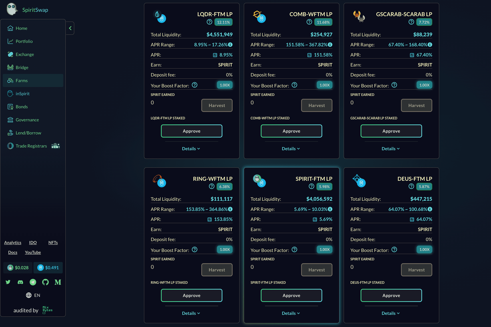

# SpiritSwap

SpiritSwap 是 Fantom Opera 链上的去中心化交易所（DEX）。 SpiritSwap 的设计基于 Uniswap 恒积自动做市商 (AMM)。在 AMM 中，流动性提供者只需存入一对代币，算法就会自动为这对代币做市。交易者可以轻松地在 AMM 中的代币之间进行交换，并获得交换的保证利率。 SpiritSwap 上的每次交换都会产生费用，该费用会分配给流动性提供者作为他们的丰厚工作报酬Fantom 上最通用的 DEX 和 DeFi 套件 🚀 释放您的 DeFi 精神！

