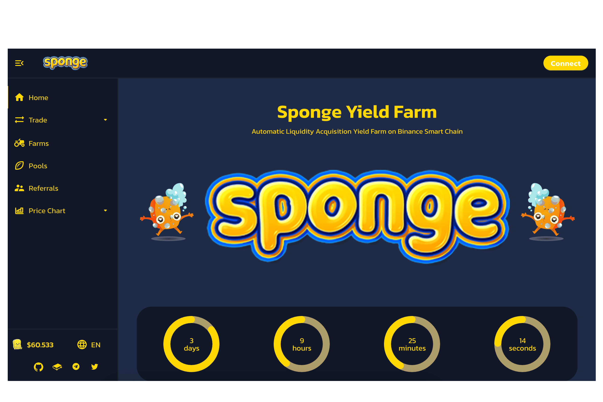

# Sponge Yield Farm

海绵农场是一个自动流动性获取收益农场，具有独特的自动燃烧和空投功能，内置在币安智能链上运行海绵产量农场。 ＃... 一般来说。 #... 在 DeFi 中。 #... 在 BNB 链中。打开 Dapp。打开 Dapp。你觉得这个页面怎么样？订阅我们的新闻。海绵收益农场Defi，海绵收益农场介绍，592区块链导航网在全球Dapp上探索NFT、NFT市场、区块链游戏、De-Fi、区块链上的Dapp。吸收器是一种革命性的单产农业协议，它结合了创新方法和混合方法来解决 DeFi 的主要问题，...通过收益框架、代币堆叠等方式赚取 Sponge 和 Soak 代币……币安智能链上唯一的浸水系统和最佳被动收益农场。

