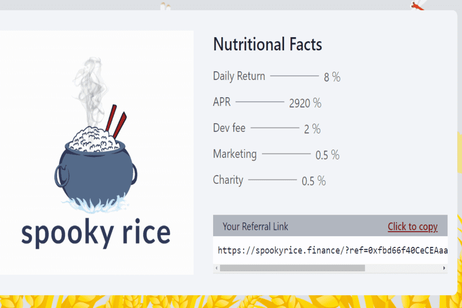

# Spooky Rice

Cooked Rice 是一个简单的智能合约，它充当 FTM 奖励池，只要奖励池中还有 FTM，每天都会返回池中 8% 的 FTM！用户可以在积累时选择吃他们的米饭（获得他们的 FTM 奖励）或重新煮他们的米饭（复合获得的 FTM 奖励）。
只需煮米饭，玩得开心，在煮饭时享受米饭奖励！
合同
BNB Miner 合约经过验证、开源、不可变、值得信赖，可在 www.ftmcan.com 上查看
这一切意味着什么？
这意味着一旦部署了合约，合约就不再需要开发人员来继续按预期运行，对于熟米饭，甚至不需要网站。每个人都可以阅读/审核并直接与代码交互，并在他们认为合适的时候做出自己的决定。一旦部署了合约，任何人都不能以任何理由停止或更改它，甚至开发人员自己也无权更改或从合约中获取任何东西。
Cooked Rice 是一个去中心化的工具，它的用户可以完全免费地访问它的内部和外部工作，以便他们可以就其对他们意图的有用性做出明智的决定。 Cooked Rice 社区和/或开发人员执行的所有其他工作纯粹是可选的，不是继续运营所必需的，并且应该被视为慈善社区贡献。
策略与信息
熟米饭适合想要长期利润和可持续性的用户。对于那些想要立即获利的人来说，最终会影响他人。矿工不是被购买的，而是被雇佣的，因此不能被出售。一旦矿工被雇用，他们就会无限期地为您工作，以每天 3% 的起始费率为您提供无限量的 FTM。

