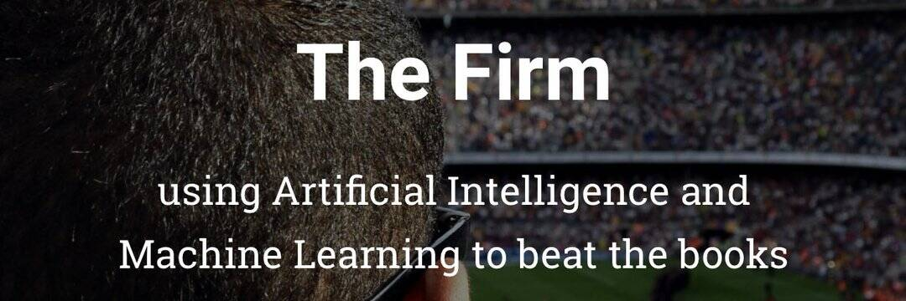

# Sports AI

涉及机器学习 (AI) 和神经网络，我们分析体育赛事的过去以预测其未来。

超级碗派对需要道具表！ 我们可能已经被 3 页冲昏了头脑，但它让游戏变得更好！ 和我们一起玩：第一名获得 100 美元 + 衬衫。 第二名获得 $30 + 衬衫我们很高兴能够帮助赞助某人参加这一盛会的旅行！ 我们希望更多的女性能够进入体育分析领域！ 我们支持你！

Sports AI旨在利用人工智能的进步实时分析运动队的表现。他们愿意开发一个应用程序，能够使用计算机视觉观看比赛并生成元数据，这些元数据将被分析以帮助教练员和运动员表现更好。

