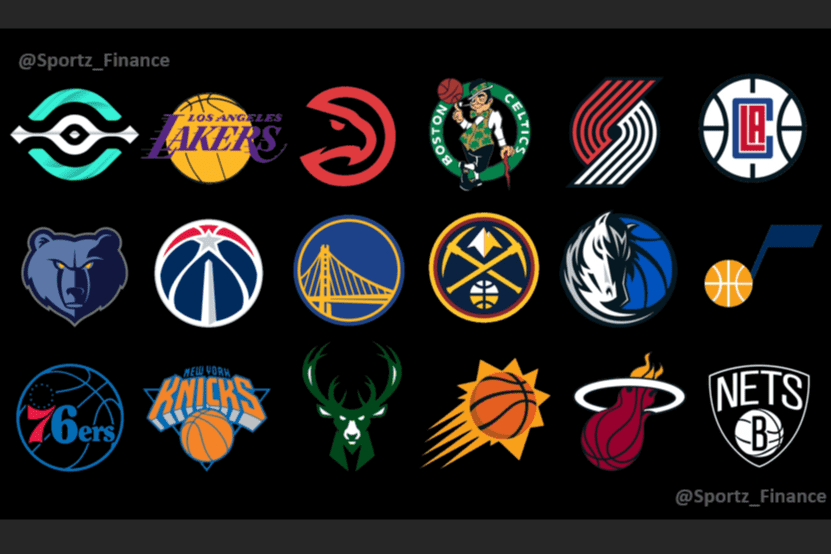

# Sportz Finance

Sportz Finance ($BALL) 是一个基于 DeFi 的体育博彩平台。
Sportz 在 NBA 季后赛期间推出。 我们在季后赛中创建了代表所有 16 支 NBA 球队的 16 个代币。 用户可以向我们的农场提供 BALL-Team LP 来赚取 BALL。 在任何农场中质押的 LP 将永远锁定（半烧毁）。
所有开发者LP都被烧毁了！
稍后将添加其他体育赛事。
文档：docs.sportz.finance
电报：https://t.me/sportzfinance
推特：@Sportz_Finance
金钱进入一项运动
（例如，门票销售、广播合同、
特许销售或赞助协议）
发生的成本（例如，球员工资、设备、旅行、高管工资以及从租金到保险费的其他费用）
收入和费用
了解收入和支出至关重要，因为体育组织将不断努力平衡以保持运营。

如果收入下降，体育组织将不得不寻找新的收入来源或削减开支。
收入和费用对体育运动的影响：付费游戏
-1990 年代开支超过收入，学校开始按学生参加的每项运动向学生收费
- 取消公车参加公路比赛；并取消高尔夫、水球和青少年大学运动等运动。

