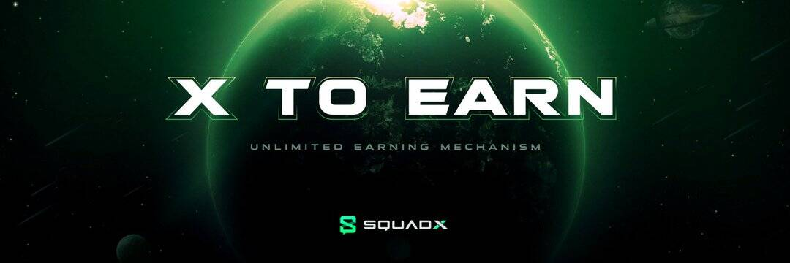

# SquadX

是什么让 SquadX 与众不同？

  内置SocialFi模型，激励用户与不同星球（聊天群）形成星际联盟，进一步鼓励用户分享想法、表达个性、结交新朋友。
  内置GameFi模型，如Planet-minting、Planet upgrade和Mystery box。
  部署在币安智能链上，与 Meta-Mask 和其他公认的 Web3 钱包完全兼容。
  友好且易于使用的界面移动应用程序
  内置市场供用户交易他们的 Planet NFT

谁是创造宝珠的创始人？
SquadX 由总部位于英国的 Meraki X Limited 于 2020 年 12 月成立。 2021年第一季度，核心团队成立。
Derek Ho 是 SquadX 的联合创始人之一。何先生是一位白手起家的连续创业者，他的远见卓识自 2017 年以来一直专注于加密货币。何先生的使命是帮助加速这一革命性技术的大规模采用，并坚信区块链将使世界变得更美好、更公平。
Ann Chiu 也是 SquadX 的联合创始人。邱管理人力资源部并协调全球三个城市的办公室日程安排。她对每一个细节的关注使组织能够顺利扩展和运行。
Victor 在公司担任首席运营官一职。 Victor 在营销策略、业务运营和产品设计方面拥有丰富的经验和远见。凭借 10 多年的游戏经验并成功孵化了多个项目，他很高兴能够将自己的经验和观点应用于新的加密领域。

