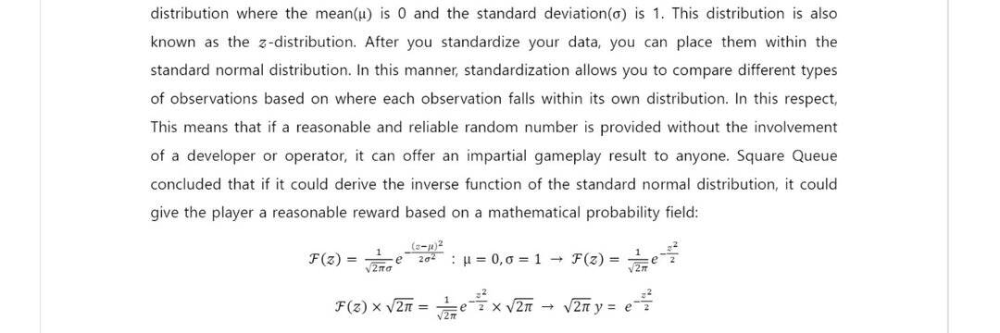

# Square Queue

每个游戏都有自己的规则和资源。 你认为所有的规则和资源都被公正地应用了吗？
Square queue旨在透明地公开游戏的核心过程并保持结果的合理性，创造一个让玩家相信游戏结果和任何随机结果的环境。
  Square Queue 将“空间”的开始指定为“游戏”，但最终将其发展为“虚拟社会”，并希望公正的法律和 虚拟社会的规则将投射到现实世界中。

当线路在门外时，这对您的业务有好处，但前提是该线路移动得很快。客户不喜欢排队等候太久，如果他们害怕等待很长时间，您可能会阻止他们将来访问您的商店。

为了保持线路（和您的收入）畅通，您的员工必须充分了解咖啡馆销售点中的工具，这些工具可以让您尽快处理交易。

