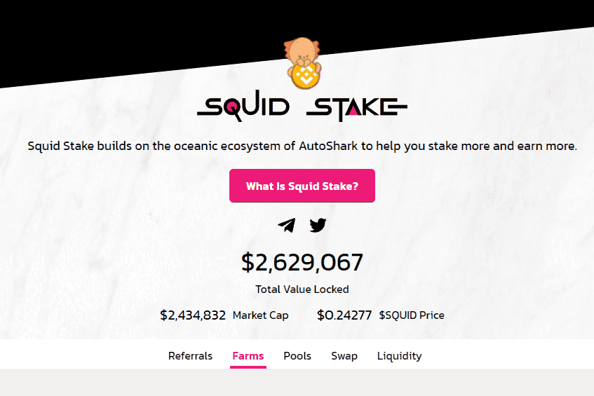

# Squid Stake

Squid Stake 是一个分散的收益农场，旨在通过稳定挂钩 APR (SPA) 通过精选农场和池提供高被动收入。 通过对原生 $SQUID 代币的不断回购和销毁以及流动性挖矿等激励模型，Squid Stake 致力于通过可持续的代币经济学模型发展平台，该模型本质上是半通缩的，同时确保为质押者提供可持续的高收益。

图表

使用 GraphQL 组织和有效访问来自区块链和存储网络的数据的索引协议。开发人员使用现有的子图或部署新的子图在很短的时间内在区块链上构建出色的应用程序。该协议已成为以太坊上 dApp 的重要组成部分。

Arweave

一种新型存储，以可持续和永久的禀赋支持数据，使用户和开发人员能够真正永久地存储数据——这是第一次。作为永远不会忘记的集体所有硬盘，Arweave 让我们能够无限期地记住和保存有价值的信息、应用程序和历史记录。通过保留历史，它可以防止其他人重写它。

