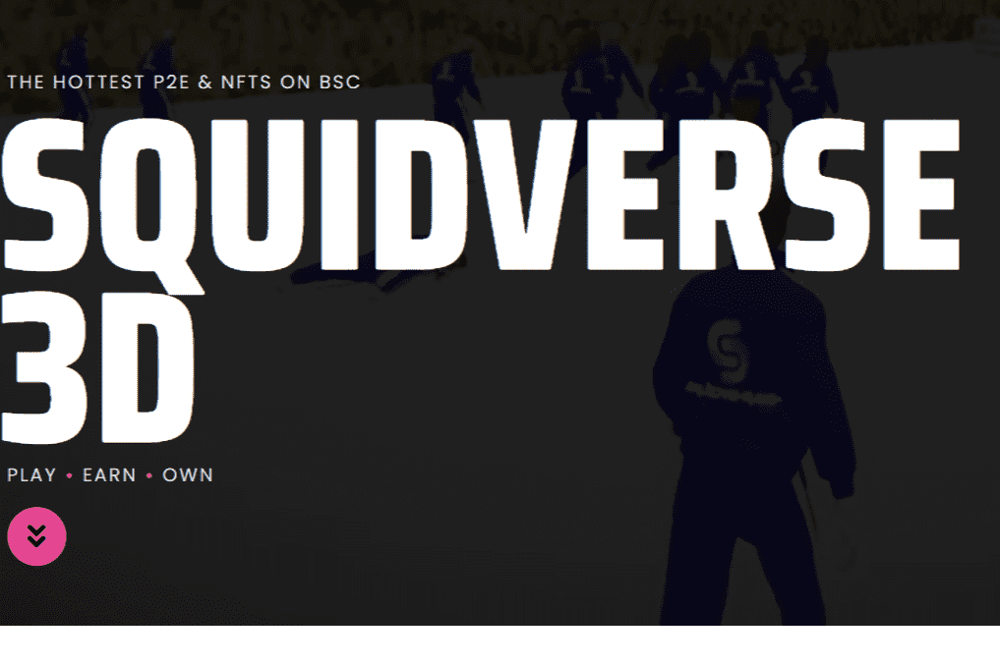

# SquidVerse3D

SQUIDVERSE 3D 是一个基于区块链技术的革命性创新去中心化金融游戏项目。该项目将形成自己的自给自足生态系统，直观地将多个公用事业连接在一起，形成一个称为 Squidverse 的“元宇宙”。其中包括（但不限于）： • SQUID 游戏：6 款高质量的 3D 即赢 (P2E) 手机和 PC 游戏，代表了它所依据的网络电视节目中的核心竞赛阶段。 • SQUID BRIDGE：一个桥接系统，允许项目稍后将币安智能链与以太坊网络连接起来，以获得以下去中心化自治组织 (DAO) 中的治理代币。 • SQUID 质押：一个允许投资者质押他们的 SQUIDVERSE 3D NFTS 以获得项目原生代币的被动奖励的系统。 • SQUIDPAD：允许独立加密货币游戏开发商孵化和推出自己的游戏的系统。玩家将能够在游戏之间无缝切换，随着连接的虚拟世界的增长而继续赚钱。该项目的每个部分都经过精心考虑，并考虑到了连通性和风格化。这不是一个模因项目，也不是一个抽水和倾销，而是一群充满激情的人尝试创建一个蓬勃发展的生态系统，通过艰苦的娱乐和流行的网络电视节目的开始来承担。

