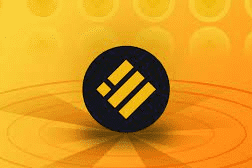

# Stable Miner

stablebusd 每天支付 1%，根据当前的挖矿效率。 随着您和其他玩家雇佣矿工、复合收益和口袋 BUSD，挖矿效率会上升和下降。
游戏的目标是比其他玩家更快、更频繁地雇佣更多的矿工。 这反过来又可以更快地为您赚取更多的 BUSD。 使用您的每日 BUSD 收入雇用更多矿工将在 30 天内或更短的时间内将您的矿工增加 3 倍。

欧易 OKX 矿池拥有领先技术，采用独创矿池架构可有效防止各种攻击，并维持挖矿服务稳定运行

