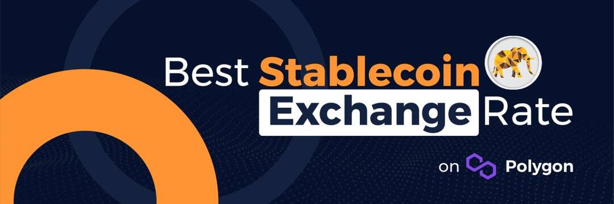

# StableGaj

StableGaj Finance 正在 Polygon 上构建稳定币 DeFi 生态系统。 我们的主要产品是一个去中心化的稳定币交易所，它允许用户在 Polygon 网络上高效地交换稳定币和锚定资产。 StableGaj 最初将支持以下稳定币：USDT、USDC、DAI 和 FRAX

StableGaj 是具有最佳汇率的稳定币交换，流动性提供者可以通过向基础流动性池提供资金来赚取稳定币形式的交易费用。 流动性提供者还可以通过种植 LP 代币或质押 StableGaj 代币来获得 StableGaj ($sGAJ) 代币奖励。

