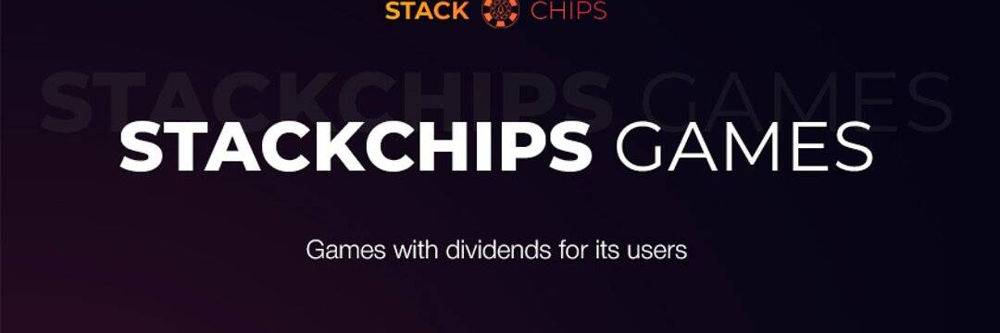

# StackChips

为其用户提供股息模型的游戏。 排行榜的 50% 利润。 前五名 1-0.3% 2-0.25% 3-0,2% 4-0.15% 5-0,1% 让我们为您介绍一下。
http://Stackchips.Games 是具有红利经济学、实时聊天和虚拟现实的游戏您可以通过区块链 EOS 的透明度轻松检查所有交易、投注、游戏机制和红利

让我们为您介绍
我们在其他社区：
Reddit：https://reddit.com/user/StackChips/comments/al32xp/let_us_introduce_to_you/……

“堆叠成就”是指 Xbox 360 上的成就系统。所有 360 游戏都有特定的目标或挑战，执行时可以获得成就。每项成就都会增加您的玩家分数。堆叠成就的工作原理如下：假设您在游戏中有 8 个章节，每击败一个章节即可获得 10 分成就。第 1 章轻松击败将是 10 分，中等 20 分，困难 30 分。如果您在第一次玩困难时击败了第 1 章，您将解锁所有 3 项成就，轻松中难度。这将是总共 60 点，并且被称为“堆叠”，因为您无需通过第 1 章玩 3 次，每个难度一次即可获得全部 3 点。并非所有 360 游戏都提供堆叠成就，您可以在互联网上搜索提供的游戏。一些例子包括战争机器和光环 3。

