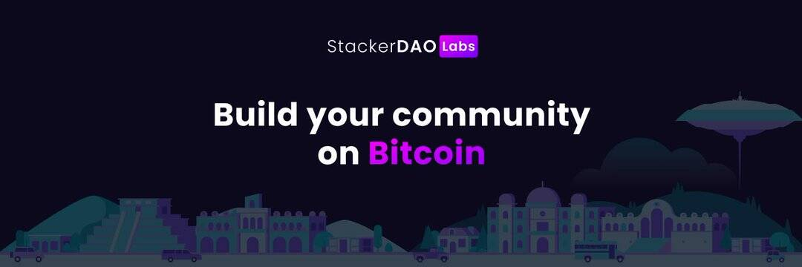

# StackerDAOs

StackerDAOs 是比特币 DAO 的一站式商店。 StackerDAO 协议是用于 Stacks 上模块化和可组合 DAO 的智能合约操作系统。 使用 StackerDAO，用户可以形成任何东西，从具有自动提案功能的完全去中心化的 DAO 到 subDAO 和多重签名。 StackerDAOs 提供了一个无代码平台，用户可以在其中启动和管理基于 StackerDAO 操作系统的 DAO。 在 StackerDAOs 上，社区可以管理其 DAO 的金库、提交提案和投票。 StackerDAOs 还提供法律技术工具，以便 DAOs 可以利用法律利益并履行合规义务，例如法人实体形成、合规表格申报和税务援助。

