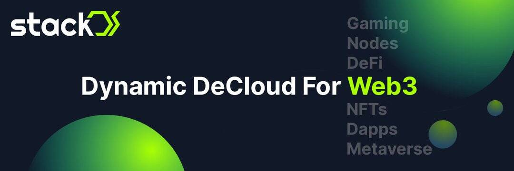

# StackOS

StackOS 是一种跨链开放协议，通过无代码、基于 UI 的应用程序部署引擎将开发人员与去中心化的计算能力连接起来。
StackOS 生态系统包括：
-提供资源的各方

- 社区通过质押堆栈代币并赚取利润和年收益率来管理协议。
- 在 StackOS 的去中心化云上部署应用程序的开发人员。 开发者可以在 StackOS 应用商店上架、销售和购买应用程序，将其转化为 NFT 并从经销商处获利。

StackOS 是一个多链去中心化云，您可以在其中运行任何应用程序，如全栈应用程序、DApps、节点、

