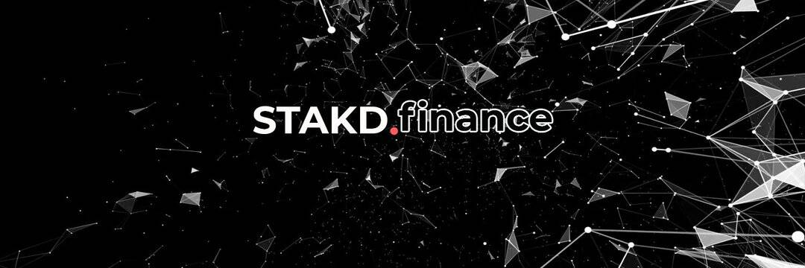

# STAKD.finance

币安智能链上强大的 DeFi 生态系统，希望通过为所有人提供一站式解决方案来彻底改变 BSC 上的 DeFi 领域。 我们的目标是为以太坊 DeFi 项目创建一个坚实的竞争对手，并希望成为 BSC 生态系统不可或缺的一部分。 STAKD 套件计划在 2021 年底之前在 BSC 上创建以下解决方案：

   流动性采矿和农业
   一种具有故障安全保护的 Rebase 机制
   质押
   已经有两个已确认项目的启动板
   稳定币收益农业
   治理
   STAKD 保险库和自动耕作

币安智能链上强大的 DeFi 生态系统，希望通过为所有人提供一站式解决方案来彻底改变#BSC 上的 DeFi 领域。

