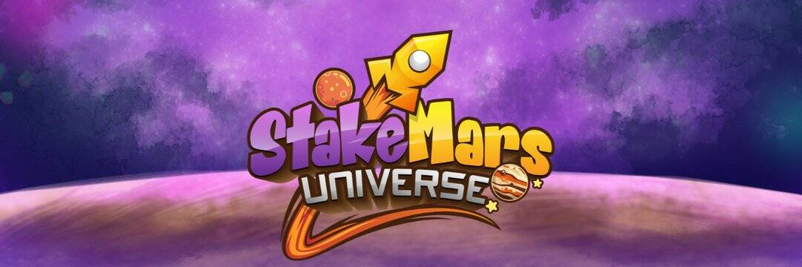

# StakeMars Protocol

从本质上讲，StakeMars 的 Gacha 基本上是一款 DeFi 老虎机游戏，它允许来自世界各地的玩家在 Polygon Chain 上进行 DeFinancially 玩 Gacha（老虎机）。
可以说这是加密世界中首创的 DeFi 老虎机游戏，用户可以选择成为 PLAYER 或 HOUSE 有推荐计划来赚钱，并且房子优势低至 1%。
该产品的主要功能是
1）DeFi老虎机（Gacha），让世界各地的玩家都可以玩。
2）玩家可以选择成为“主持人”或“玩家”
3）推荐系统，允许玩家邀请他们的朋友并获得一些奖励。
4) 庄家优势低至 1%。
此外，当用户玩我们的 Gacha 时，他们将获得 NFT，这些 NFT 将用于我们开发的游戏中。

