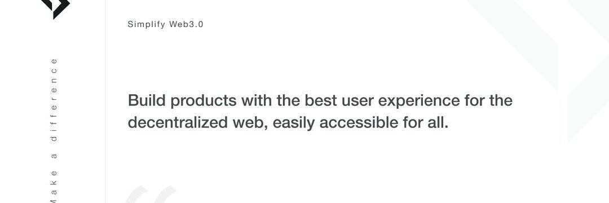

# Stakepool

使用 Stakepool，您可以通过预测美元价值的未来 tez 价格范围来获得额外的质押奖励。 如果您在下注周期之后的 2 个周期完成时正确预测了 tez 价格范围，您将获胜。 智能合约中产生的所有烘焙奖励作为总质押金额的加权平均值分配给获胜者。 如果您的预测错误，您的质押 tez 将被退回，但您会错过相应周期的质押奖励。

👉建设#web3？
👉不知道如何设计 UI？
👉没有灵感？

不要再看了，使用我们的开源设计开始吧！

