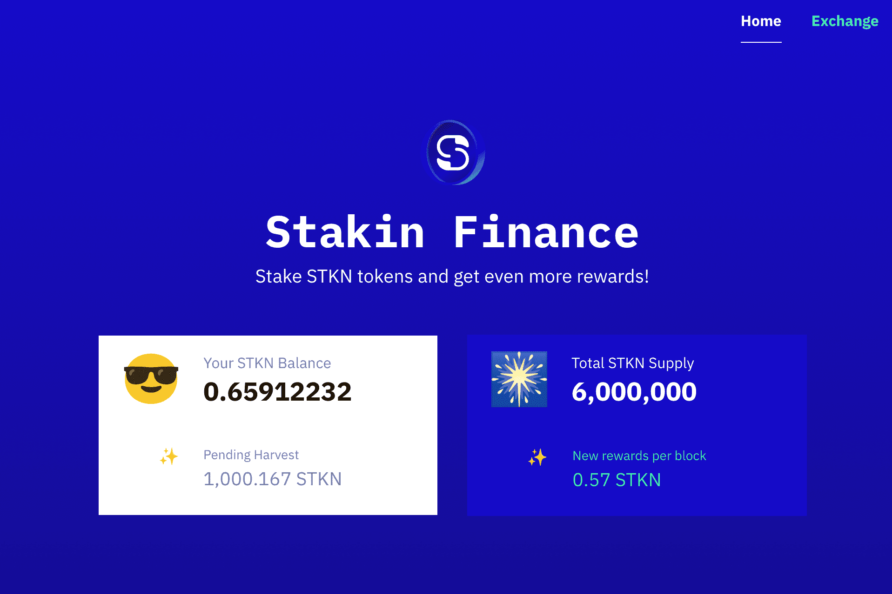

# Stakin Finance

Stakin Finance 是一种在币安智能链 (BSC) 上运行的自动化做市和收益农业以及 Staking 协议。
使用 Stakin Finance，用户可以为矿池提供流动性，在彼此之间交换数字资产，质押他们的代币，并获得 $STKN 的额外收益。
Stakin Finance 使世界各地的区块链用户能够参与产生收益的活动并微调他们的数字资产投资策略。
该项目由 Stakin.com 开发，Stakin.com 是一家领先的 Staking 服务提供商，在多个 Proof-of-Stake 网络上开展业务。

什么是斯金金融？
Stakin Finance 是一种在币安智能链 (BSC) 上运行的自动化做市和收益农业和 Staking 协议。 它使全球区块链用户能够参与产生收益的活动并微调他们的数字资产投资策略。

