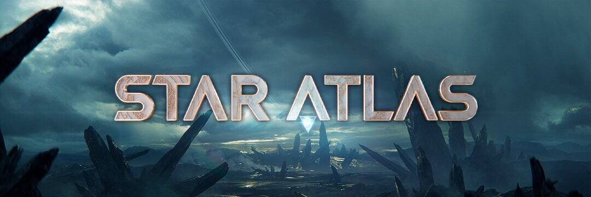

# Star Atlas

Star Atlas 是从最先进的区块链、实时图形、多人视频游戏和去中心化金融技术的融合中出现的下一代游戏元世界。
使用 Unreal Engine 5 Nanite 的实时图形技术可实现电影级视频游戏视觉效果。 使用 Solana 协议的区块链技术建立了一种基本上无服务器且安全的游戏体验。 在 Star Atlas 中获得和交易的不可替代代币创造了一种复制现实世界资产和所有权的有形性的经济体。 要了解更多信息，请访问 StarAtlas.com，加入 Play.StarAtlas.com 上的派系，并使用您的宇宙飞船 NFT 加入舰队！

